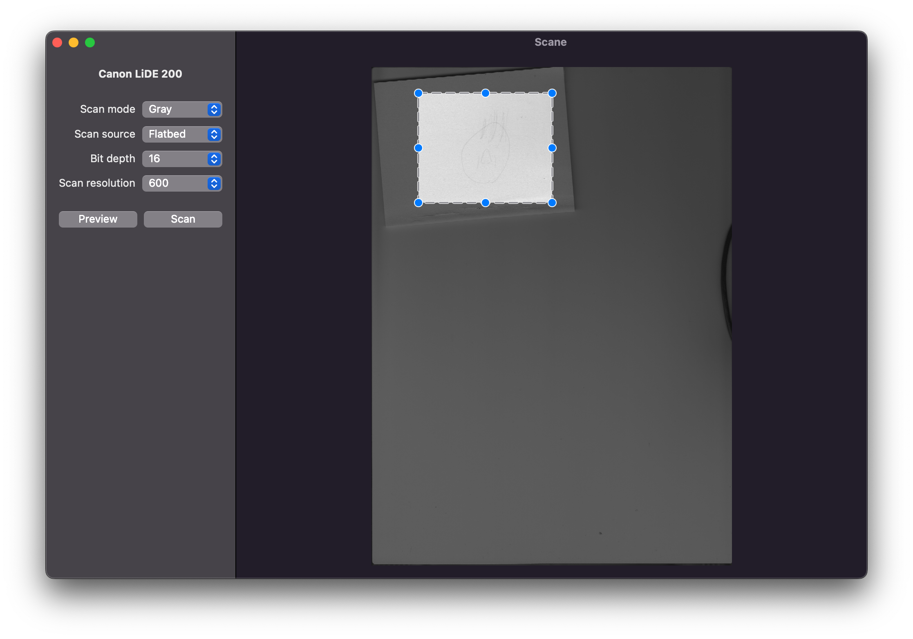

# SCANE

A MacOS frontend for [SANE](http://www.sane-project.org).

Did Apple unceremoniously drop support for your scanner?  Did the manufacturer stop updating its own drivers?  Don't dump that old thing in the local watershed, Scane will let you continue using your beloved device for many years to come.  Maybe!

## Requirements

You will need:

* A Mac with at least MacOS Catalina
* [A device supported by SANE](http://www.sane-project.org/sane-mfgs.html)
* Possibly, some amount of luck

## Known Issues

Scane was designed to make the simplest use case work well: a single scanner connected via USB.  To that end:
* Scane only works with a single connected device.  If you have multiple connected scanners, one will randomly be selected.
* SANE's "advanced" device properties are not shown, purely because the advanced properties for my own scanner were boring.
* Planar RGB devices don't yet work.  Which scanners are planar RGB devices?  I dunno!
* Scanners with indeterminate line length don't yet work.  I think this is mostly sheet-fed scanners.
* No SANE custom configuration can be specified.

File bugs and feature requests in the Issues page.

## Authors

Matt Adam

## License

The Scane frontend is MIT-licensed.
The Sane backend is (generally) GPL-licensed, the license is viewable [here](https://gitlab.com/sane-project/backends/-/blob/master/LICENSE).
